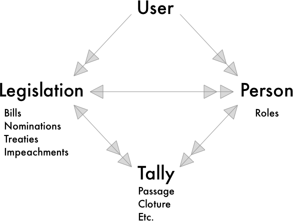

# Kratos

### Major Types & Reference Structure



### Conventions

---

<details><summary>UITableViewCells</summary><p>

> To reduce stringyness within the application, each tableViewCell should have a string static variable named `identifier`. This should be a string defined as such: 

```

class TableViewCell: UITableViewCell { 
  static let identifier = String(describing: TableViewCell.self) 
}

```

> Cells should always have a configuration function that lays out the cell. A cells' content should not be set or altered from the TableView class if possible. Cell's should be completely responsible for their own behavior.

</p></details>

---
